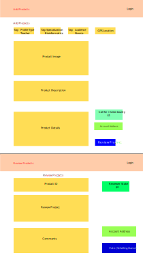

## Avrit UI for Blockchain

### Avrit User Interface
A decentralized way of designing and reviewing the quality and the importance of study material or content, assignments, projects, practicals and assessments. 

Attributes based on which content will be reviewed:  
https://iambrainstorming.wordpress.com/2017/01/14/all-books-that-dont-meet-the-learning-criteria-must-be-taken-off/

### Avrit Whitepaper   
https://avrit.reaudito.com

### Demo App
https://avritdemo.vercel.app

### Example Evidence Of Learning  
Design probing question on Human Nutrition and use the Feynman technique to explain  
https://avritdemo.vercel.app/#/product/1  

Video:  

Pages:

 
 

Build with near protocol blockchain, ipfs and react

